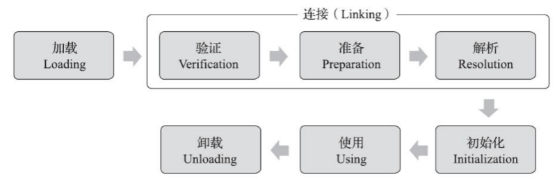

## 操作系统

### 请你说说虚拟内存和物理内存的区别

1 物理内存 以前, 还没有虚拟内存概念的时候,程序寻址用的都是物理地址。程序能寻址的范围是有限的,这取决于 CPU 的地址线条数。比如在 32 位平台下,寻址的范围是 2^32 也就是 4G。并且这是固定的, 如果没有虚拟内存, 且每次开启一个进程都给 4G 物理内存,就可能会出现很多问题：

- 因为物理内存是有限的, 当有多个进程要执行的时候, 都要给 4G 内存, 很显然内存不够,这很快就分配完了,于是没有得到分配资源的进程就只能等待。当一个进程执行完了以后,再将等待的进程装入内存。这种频繁的装入内存的操作效率很低 
-  由于指令都是直接访问物理内存的,那么任何进程都可以修改其他进程的数据,甚至会修改内核地址空间的数据,这是不安全的

2 虚拟内存 由于物理内存有很多问题,所以出现了虚拟内存。虚拟内存是计算机系统内存管理的一种技术。它使得应用程序认为它拥有连续的可用的内存（一个连续完整的地址空间）,而实际上,它通常是被分隔成多个物理内存碎片,还有部分暂时存储在外部磁盘存储器上,在需要时进行数据交换。

### 请你说说IO多路复用

I/O 多路复用是一种使得程序能同时监听多个文件描述符的技术,从而提高程序的性能。I/O 多路复用能够在单个线程中,通过监视多个 I/O 流的状态来同时管理多个 I/O 流,一旦检测到某个文件描述符上我们关心的事件发生（就绪）,能够通知程序进行相应的处理(读写操作) Linux 下实现 I/O 复用的系统调用主要有 select、poll 和 epoll。

#### select

>select 的主旨思想： 
>
>- 首先要构造一个关于文件描述符的列表,将要监听的文件描述符添加到该列表中,这个文件描述符的列表数据类型为 fd_set,它是一个整型数组,总共是 1024 个比特位,每一个比特位代表一个文件描述符的状态。比如当需要 select 检测时,这一位为 0 就表示不检测对应的文件描述符的事件,为 1 表示检测对应的文件描述符的事件。
>
>- 调用 select() 系统调用,监听该列表中的文件描述符的事件,这个函数是阻塞的,直到这些描述符中的一个或者多个进行 I/O 操作时,该函数才返回,并修改文件描述符的列表中对应的值,0 表示没有检测到该事件,1 表示检测到该事件。函数对文件描述符的检测的操作是由内核完成的。 - select() 返回时,会告诉进程有多少描述符要进行 I/O 操作,接下来遍历文件描述符的列表进行 I/O 操
>
>select 的缺点： 
>
>- 1. 每次调用select,都需要把 fd 集合从用户态拷贝到内核态,这个开销在 fd 很多时会很大；
>  2. 同时每次调用 select 都需要在内核遍历传递进来的所有 fd,这个开销在 fd 很多时也很大；
>  3. select 支持的文件描述符数量太小了,默认是 1024（由 fd_set 决定）；
>  4. 文件描述符集合不能重用,因为内核每次检测到事件都会修改,所以每次都需要重置； 
>  5. 每次 select 返回后,只能知道有几个 fd 发生了事件,但是具体哪几个还需要遍历文件描述符集合进一步判断。

#### poll

> poll 的原理和 select 类似, poll 支持的文件描述符没有限制。

#### epoll

> epoll 是一种更加高效的 IO 复用技术,epoll 的使用步骤及原理如下：
>
> - 调用 epoll_create() 会在内核中创建一个 eventpoll 结构体数据, 称之为 epoll 对象,在这个结构体中有 2 个比较重要的数据成员,一个是需要检测的文件描述符的信息 struct_root rbr（红黑树）,还有一个是就绪列表struct list_head rdlist,存放检测到数据发送改变的文件描述符信息（双向链表）
> - 调用 epoll_ctrl() 可以向 epoll 对象中添加、删除、修改要监听的文件描述符及事件；
> - 调用 epoll_wt() 可以让内核去检测就绪的事件,并将就绪的事件放到就绪列表中并返回,通过返回的事件数组做进一步的事件处理
>
> 两种工作模式
>
> - LT 模式（水平触发）
>   -  LT（Level - Triggered）是缺省的工作方式,并且同时支持 Block 和 Nonblock Socket。在这种做法中,内核检测到一个文件描述符就绪了,然后可以对这个就绪的 fd 进行 IO 操作,如果不作任何操作,内核还是会继续通知。
> -  ET 模式（边沿触发）
>   -  ET（Edge - Triggered）是高速工作方式,只支持 Nonblock socket。在这种模式下,当描述符从未就绪变为就绪时,内核通过 epoll 检测到。然后它会假设你知道文件描述符已经就绪,并且不会再为那个文件描述符发送更多的就绪通知,直到你做了某些操作导致那个文件描述符不再为就绪状态了。
>   - 注意 : 
>     - 如果一直不对这个 fd 进行 IO 操作（从而导致它再次变成未就绪）,内核不会发送更多的通知（only once）。 ET 模式在很大程度上减少了 epoll 事件被重复触发的次数,因此效率要比 LT 模式高。epoll 工作在 ET 模式的时候,必须使用非阻塞套接口,以避免由于一个文件描述符的阻塞读/阻塞写操作把处理多个文件描述符的任务饿死。

### 请你说说线程和协程的区别

1 线程是操作系统的资源,线程的创建、切换、停止等都非常消耗资源,而创建协程不需要调用操作系统的功能,编程语言自身就能完成,所以协程也被称为用户态线程,协程比线程轻量很多；

2 线程在多核环境下是能做到真正意义上的并行,而协程是为并发而产生的；

3 一个具有多个线程的程序可以同时运行几个线程,而协同程序却需要彼此协作的运行；

4 线程进程都是同步机制,而协程则是异步

5 线程是抢占式,而协程是非抢占式的,所以需要用户自己释放使用权来切换到其他协程,因此同一时间其实只有一个协程拥有运行权,相当于单线程的能力； 

6 操作系统对于线程开辟数量限制在千的级别,而协程可以达到上万的级别。

## JAVA基础

### 请说说你对反射的了解

要点 : 需要反射的原因  反射可以实现的操作, 反射的应用场景

程序在运行时可能会收到外部传入的对象, 该方法在编译时类型为 Object, 但程序有需要调用该对象的运行时类型方法. 为了解决这个问题,程序需要在运行时发现对象和类的真实信息. 然而 , 如果编译时根本无法预知对象和类属于哪些类, 程序只能依靠运行时信息来发现该对象和类的真实信息, 此时就必须使用到反射了.

可以通过反射实现如下操作:

- 程序运行时, 可以通过反射获得任意一个类的Class对象, 并通过这个对象查看这个类的信息
- 程序运行时, 可以通过反射创建任意一个类的实例, 并访问该实例的成员;
- 程序运行时, 可以通过反射机制生成一个类的动态代理类或动态代理对象

反射的应用场景:

- 使用JDBC时, 如果创建数据库的连接, 需要通过反射加载数据库的驱动程序
- 多数框架支持注解和XML配置,从配置中解析出来的类是字符串, 需要利用反射机制实例化
- 面向切面编程(AOP)的实现方案, 程序运行时创建的目标对象的代理类需要通过反射来实现Q

### 请你说说 ArrayList 和 LinkedList 的区别

底层实现, 数据和双向链表  是否支持随机访问和事件复杂度 插入删除  占用内存

1 底层实现ArrayList是数组, LinkedList 底层是双向链表

2 ArrayList 支持通过索引下标随机访问, 时间复杂度O(1) , LinkedList 不支持随机访问, 访问需要遍历链表 ,时间复杂度O(n)

3 删除和插入场景下, LinkedList 更好, 因为时间复杂度为O(1) , 而ArrayList平均复杂度为n(n)

4 LinkedList 占用存储空间更多, 处理存储数据 ,还要存储指向前后节点的引用

### 你知道哪些线程安全的集合 ? 

1 java.util 包下的大部分集合都是线程不安全的, 但是也有很少数的是线程安全的比如, vector 和 hashTable , 他们都是比较老的API, 虽然是线程安全的, 但是性能很差, 不推荐使用 .

2 从 JDK 1.5 开始, 并发包下新增了大量高效的并发容器, 这些容器按照实现机制可以分为三类, 

- 第一类, <strong>通过降低锁粒度来提高并发性能的容器</strong>, 类名以 `Concurrent` 开头, 如 `ConcurrentHashMap` 
- 第二类, 采用写时复制技术实现的并发容器，类型以 `CopyOnWrite` 开头， 如 `CopyOnWriteArrayList` 
- 第三类，采用 Lock 实现的阻塞队列， 内部创建两个 Condition 分别用于生产者和消费者的等待，这些类都实现了 `BlockingQueue` 接口， 如 `ArrayBlockingQueue` 

3 Collections 提供了三类方法来返回一个不可变的集合，这三类方法的参数是原有集合的对象，返回值是该集合的”只读“版本。

- `emptyXxx()`: 返回一个空的不可变的集合对象
- `singletonXxx()`: 返回一个只包含指定对象的不可变的集合对象
- `unmodifiableXxx()`: 返回指定集合对象的不可变视图

### 请你说说 ConcurrentHashMap 

`ConcurrentHashMap` 在 JDK 1.7 和 JDK 1.8 的实现方式是不同的

#### JDK1.7 的实现方式

是由 `Segment`  数据结构和 `HashEntry`数据结构组成， `ConcurrentHashMap` 把哈希桶切分成小数组 （`Segment`）， 每个小数组有 n 个 `HashEntry` 组成， 其中 `Segment` 继承了  `ReentranLock`， 所以 `Segment` 是一种可重入锁， 扮演锁的角色 ： `HashEntry`用于存储键值对数据。

首先将数据分为一段一段的存储， 然后给每一段数据配一把锁， 当一个线程占用锁访问其中一个数据时，其它段的数据也能被其它线程访问， 能够实现真正的并发访问。

#### JDK1.8 的实现方式

在数据结构上， JDK 1.8 中的 `ConcurrentHashMap` 选择了与 `HashMap` 相同的数组 + 链表 + 红黑树结构

在锁的实现上， 抛弃了原有的 `Segment` 分段锁，采用 `CAS+synchronized`实现更加细粒度的锁。将锁的级别控制在更细粒度的哈希元素级别， 也就是说只需要锁住这个链表表头节点，（红黑树的根节点），就不会影响其它的哈希通元素的读写，大大提高了并发度。

`ConcurrentHashMap` 线程安全的实现机制

1 初始化数组或头节点时, `ConcurrentHashMap` 并没有加锁,而是 `CAS` 的方式进行原子替换（原子操作,基于Unsafe类的原子操作API）

2  插入数据时会进行加锁处理,但锁定的不是整个数组,而是槽中的头节点。所以,`ConcurrentHashMap`中锁的粒度是槽,而不是整个数组,并发的性能很好。

3  扩容时会进行加锁处理,锁定的仍然是头节点。并且,支持多个线程同时对数组扩容,提高并发能力。每个线程需先以`CAS`操作抢任务,争抢一段连续槽位的数据转移权。抢到任务后,该线程会锁定槽内的头节点,然后将链表或树中的数据迁移到新的数组里

4 查找数据时并不会加锁,所以性能很好。

### 说说你了解的线程同步方式

Java 主要通过锁机制实现线程同步 ，锁分为 Synchronized 和 Lock 。synchronized 可以加在三个不同的位置，对应三种不同的使用方式，这三种方式的是锁不同的对象。

1 加在方法上，锁的是当前对象的this实例

2 加在静态方法上，则锁是当前类的Class对象

3 加在代码块上，则需要在关键字后面的小括号里，显示指定一个对象作为锁对象。

不同的锁对象，意味着不同的锁粒度，所以不应该无脑地加在方法前，应该合适地根据需要锁定的范围，准确的选择锁对象，从而准确确定锁的粒度，降低锁带来的性能开销

Synchronized 是比较早期的API，没有考虑超时机制，非阻塞获取锁机制以及多个条件变量。

JDK 1.5 引入了 Lock 接口，并支持上述功能。

Lock 支持的功能包括，支持响应中断，支持超时机制，支持非阻塞方式获取锁，支持多个条件变量。

Lock 采用 CAS + volatile 实现， 其实现核心是AQS， AQS 是线程同步器，是一个线程同步的基础框架，它是基于模板方法模式。在具体的Lock实例中，锁的实现是通过 AQS 来实现，并且可以根据锁的使用场景，派生出公平锁，不公平锁，读锁，写锁等具体实现。

### String, StringBuffer 和 Stringbuilder 有什么区别？

得分点 字符串是否可变，StringBuilder 和 StringBuffer 线程安全问题

Java 提供了String 和 StringBuffer 两个类封装字符串，并且提供了一系列方法来操作字符串对象。

String 是一个不可变类，也就是说，一个String 对象创建之后，,直到这个对象销毁为止,对象中的字符序列都不能被改变。

StringBuffer对象则代表一个字符序列可变的字符串,当一个StringBuffer对象被创建之后,我们可以通过StringBuffer提供的append()、insert()、reverse()、setCharAt()、setLength()、等方法来改变这个字符串对象的字符序列。

StringBuilder类是JDK1.5中新增的类，它也代表了字符串对象。StringBuffer 和 StringBuilder 有共同的的父类 AbstractStringBuilder ，

二者无论是构造器还是方法都基本相同,不同的一点是,StringBuilder没有考虑线程安全问题, 所以StringBuilder 性能更高。

所以单线程下操作大量数据，使用StringBuilder ，在多线程下使用StringBuffer。

### 请你说说 HashMap的底层原理

三个角度，数据结构， put() 流程， 扩容机制

`JDK1.8` 底层是采用 “数组 + 链表 + 红黑树，来实现的。 `HashMap` 是基于哈希算法来确定元素的位置（槽）的,当我们向集合中存入数据时,它会计算传入的`Key`的哈希值,并利用哈希值取余来确定槽的位置。如果元素发生碰撞,也就是这个槽已经存在其他的元素了, 则`HashMap`会通过链表将这些元素组织起来。如果碰撞进一步加剧,某个链表的长度达到了8,则`HashMap`会创建红黑树来代替这个链表,从而提高对这个槽中数据的查找的速度。

扩容 ： HashMap 中数组的默认初始容量为16，这个容量会以 2 的指数进行扩容，具体来说当元素达到一定比例HashMap就会扩容，这个比例叫做负载因子，默认0.75。自动扩容机制，是为了保证 HashMap 在初始时不用占用太大空间，在使用期间又可以实时保证有足够大的空间。采用 2 的指数进行扩容，是为了进行位运算，提高扩容运算的效率。

扩容机制： 

向HashMap添加数据，会触发扩容操作行为：

- 如果数组为空，则进行首次扩容
- 将元素接入链表后，如果链表长度达到8，并且数组长度小于64，则扩容
- 添加后，如果数组中元素超过阈值，即默认比例0.75，则扩容。每次扩容将容量翻倍，创建一个2倍大的新数组，然后将旧数组中的数据迁入新的数组。

put() 流程： 

- 首先判断数组是否为空，为空则进行首次扩容
- 判断头节点，若头节点为空新建链表，放入数组
- 判断头节点，若发现头节点非空，则将元素加入槽内4
  - 若元素的key与头节点一致，则直接覆盖头节点。
  - 若元素为树型节点，则将元素追加到树中
  - 若元素为链表节点，则将元素追加到链表中，追加后判断长度，若链表长度达到8，数组未达到64，数组进行扩容，若链表长度达到8，数组容量达到64，则转为红黑树。
- 将元素加入槽内后，判断元素个数，若发现元素个数超过阈值则再次进行扩容。

HashMap 是非线程安全的，在多线程环境下，多个线程同时触发HashMap改变时，可能发生冲突。所以多线程下不建议使用HashMap，可以考虑使用ConcurHashMap或者使用collections将HashMap转化为线程安全的HashMap。

### 说说你了解的 JVM 内存模型

得分点：类加载子系统，执行引擎，运行时数据区

JVM 由三部分组成：类加载子系统，执行引擎，运行时数据区。

1 类加载子系统，可以根据指定**类的全限定名**来载入类或接口

2 执行引擎，负责**执行**那些包含在**被载入类的方法的方法中的指令**。

3 当程序运行时，JVM 需要内存来存储许多内容，例如：字节码，对象，参数，返回值，局部变量，运算的中间结果。JVM 将这些数据存储至运行时数据区中，以便于管理。运行时数据区可以分为**方法区，堆，虚拟机栈，本地方法栈，程序计数器**。

运行时数据区的几块空间中，方法区和堆是线程之间共享的内存区域，而虚拟机栈，本地方法栈，程序计数器是线程私有的区域，就是说每个线程都有自己的这个区域。

### 说说垃圾回收机制

得分点：新生代收集，老年代收集，混合收集，整堆收集

当前商业虚拟机的垃圾收集器，大多数都遵循了“分代收集”的理论进行设计，分代收集名为理论，实质是一套符合大多数程序运行实际情况的经验法则。

根据垃圾回收理论垃圾回收可以分为如下几类：

1 新生代收集，目标为新生代的垃圾收集对象

2 老年代收集，目标为老年代的垃圾收集，目前只有CMS收集器会有这种行为

3 混合收集：目标为整个新生代及部分老年代的垃圾收集，目前只有 G1 收集器会有这种行为。

4 整堆收集：目标为整个堆和方法区的垃圾回收。

hotspot 虚拟机 还内置了很多垃圾收集器，其中针对新生代的垃圾收集器有Serial， Parnew，Parallel Scavenge ，针对老年代的垃圾收集器有 CMS，serial old，Parallel Old。此外，HotSpot 还内置G1收集器面向堆垃圾的回收。

在这些收集器中，常见的组合方式有 ： 

1：Serial + serial old ：是客户端模式下的常用的收集器

2：ParNew + CMS ： 是服务端模式下的常用收集器

3：Parallel Scavenge + Parallel Old：适用于后台运算而不需要太多交互的分析任务。

### 说说类加载机制

得分点：

加载，验证，准备，解析，初始化

一个类型从被加载到内存中开始，到卸载出内存为止，它的整个生命周期将会经历加载、验证、准备、解析、初始化，使用，卸载七个阶段，其中验证，准备，解析三个部分统称为连接，前五个阶段则是类加载过程的完成过程。



1 在加载阶段JVM需要在内存中生成一个代表这个类的Class对象，作为方法区这个类的各种数据的访问入口。

2 验证阶段大致上会完成下面四个阶段的检验动作：文件格式验证、元数据验证、字节码验证、符号引用验证。

3 准备阶段是正式为定义的静态变量变量分配内存并设置变量初始值的阶（这些变量所用的内存都应当在方法区中进行分配，但必须注意到方法区是一个逻辑上的区）

4 解析阶段是 Java 虚拟机将常量池内的符号替换为直接引用的过程，符号引用以一组符号来描述所引用的目标，直接引用是可以直接指向目标的指针、相对偏移量或者一个能间接定位到目标的句柄。

5 类的初始化阶段是类加载过程的最后一个步骤，直到初始化阶段，Java虚拟机才真正开始执行类中编写的Java程序代码，将主导权移交给应用程序。本质上，初始化阶段就是执行类构造器`<clinit>()`的过程。`<clinit>()`并不是程序员在Java代码中直接编写的方法，它是 Javac 编译器的自动生成物。

对于初始化阶段，严格规定有六种情况必须立即对类进行“初始化”

1 使用 new 实例化对象，读写类的静态字段，调用类的静态方法时

2 使用 java.lang.reflect 包的方法对类型进行反射调用

3 当初始化类时，若发现其父类还没有进行过初始化，则先初始化这个父类。

4 虚拟机启动时，需要指定一个要执行的主类，虚拟机会先初始化这个主类。

5 当一个接口中定义了JDK 8新加入的default方法接口方法时，如果有这个接口的实现类发生了初始化，那该接口要在其之前被初始化。


## Redis

### 请你说说Redis的数据类型

主要提供了5中数据结构, 分别为 String , hash, list, set, Zset

String 类型最长可以存储 512MB长度的字符串, 字符串是二进制, 所以长度是固定, 是安全的.

hash 是字符串与字符串索引的映射, 它们适合表示对, 每个哈希可以存储多达 2^32– 1 个字段-值对

list 列表是字符串列表, 按照插入的顺序排序, 可以lpush插入到列表头, 也可以Rpush插入到列表尾部, 列表最大长度 2^32-1个元素

set 是redis中的无序集合,在 redis sorted sets 中 当集合items数量大于64时, 同时使用了 ziplist (压缩列表) 和 skiplist (跳表) 列表一同实现, 添加和删除都需要修改 skiplist , 时间复杂度 时O(logn)  , 如果仅仅是查找元素直接使用hash , 其复杂度为 O(1) , 其它的range操作复杂度一般为, O(logn) , 当然如果item小于64, 使用的是ziplist, 时间复杂度就是 O(n) , 最大成员数为 2^32-1 个元素

zset 是有序集合, 是一组非重复的字符串集合 , 里面每一个成员都与一个分数相关联, 该分数用于获取从小到最高分数的有序排序集 , 成员不重复, 但是分数可以重复.

还提供了 bitMap , hyperloglog, Geo , redis 5.0 还提供了Streams数据类型

### 说说缓存穿透、击穿和雪崩的区别

<strong>缓存穿透</strong>: 客户端或恶意用户<strong>查询了不存在数据， 使请求到达存储层， 导致存储层负载过大甚至造成宕机</strong>。这种情况的出现可能是由于业务层误将缓存层将缓存和库中的数据删除造成的，当然也不排除有人恶意攻击，专门访问数据库中不存在的数据导致缓存穿透。

<strong>解决方案</strong>: 我们可以通过缓存空对象是指当存储层未命中后，仍然还空值，仍然将空值存入缓存层，当客户端再次访问数据时，缓存层直接返回空值。还可以将数据存入布隆过滤器，访问缓存之前以过滤器拦截，若请求的数据不存在则直接返回空值。

<strong>缓存击穿</strong>：当一份<strong>访问量非常大的热点数据缓存失效的瞬间</strong>，大量的请求直达存储层，导致服务器崩溃。

通过热点数据不设置过期时间来解决，这样就不会出现上述的问题，或者为每个数据设置逻辑过期时间，当发现该数据逻辑过期时，单独使用线程重建缓存。除了永不过期的方式,我们也可以通过加互斥锁的方式来解决缓存击穿,即对数据的访问加互斥锁,当一个线程访问该数据时,其他线程只能等待。

<strong>缓存雪崩</strong>：是指当某一时刻缓存层无法继续提供服务，导致所有的请求直达存储层，造成数据库宕机。

原因 ： 可能是某一时刻缓存中有大量数据过期，也可能是 `Redis` 节点发生故障，导致大量请求无法得到处理。

解决方式 ：

- 在设置过期时间，附加随机值避免大量的 key 同时过期
- 启用降级和熔断措施，即发生雪崩时，若应用访问的不是核心数据，则直接返回预定义信息/空值/错误信息，或发生雪崩时，对于访问缓存接口的请求，客户端并不会把请求发送给 `Redis` ， 而是直接返回。
- 构建可用高的Redis服务，也就是采用哨兵或集群模式，部署多个Redis实例，即使个别节点宕机，依然可以使用整体的服务。

### `Redis` 如何与数据库保持双写的一致性

关键点：四种同步策略及其可能出现的问题，重试机制

保证缓存和数据库的双写一致性，共有四种同步策略，即先更新缓存再更新数据库，先更新数据库再更新缓存，先删除缓存再更新数据库、先更新数据库再删除缓存。

先更新缓存再更新数据库 ： 

优点 ：每次数据变化时都能及时地更新缓存, 这样不容易出现查询未命中的情况

缺点：操作的消耗很大,如果数据需要经过复杂的计算再写入缓存的话, 频繁的更新缓存会影响到服务器的性能。如果是写入数据比较频繁的场景, 可能会导致频繁的更新缓存却没有业务来读取该数据。	

先删除缓存再更新数据库：

优点：操作简单, 无论更新的操作复杂与否, 都是直接删除缓存中的数据。

缺点： 当删除了缓存之后, 下一次查询容易出现未命中的情况, 那么这时就需要再次读取数据库。 

那么对比而言, 删除缓存无疑是更好的选择。先删除缓存再操作数据库的话, 如果第二步骤失败可能导致缓存和数据库得到相同的旧数据。先更新数据库但删除缓存失败的话则会导致缓存和数据库得到的结果不一致。出现上述问题的时候，先删除缓存依然可能存在缓存中存储了旧的数据，而数据库中存储了新的数据二者数据不一致的情况。所以先更新数据库，再删除缓存是影响最小的方案，如果第二部出现失败的情况，则可以采用重试机制解决问题。

## 设计模式

###请你讲一讲单例模式,请你手写一下单例模式

#### 饿汉式单例模式

优点: 

缺点: 

#### 懒汉式单例模式

优点: 

缺点: 

安全懒汉式单例模式

双重检验锁单例模式

内部类单例模式(饿汉式)

### 请你讲讲工厂模式,  手写工厂模式

工厂模式包括三种, 简单工厂模式, 工厂方法模式抽象方法模式

简单工厂模式

简单地对不同类对象的创建进行了简单的封装, 该模式通过向工厂传递类型来指定要创建的对象 

```java

```


## 数据库

### 请你说说 innodb 和 myisam 的区别 ？

得分点 ： 事务、锁、读写性能、存储结构。

InnoDB 是具有事务、回滚和崩溃修复能力的事务安全型引擎，它可以实现行级锁保证高性能的大量数据中的并发操作；

MyISAM 是具有默认支持全文索引，压缩功能及较高查询性能的非事务性引擎。

数据锁 ： InnoDB 支持行级锁；MyISAM 只支持表级锁。

读写性能： InnoDB 支持外键，MyISAM 不支持。

存储结构：InnoDB 在磁盘存储为一个文件，MyISAM 在磁盘上存储成三个文件（表定义，数据，索引）

存储空间：InnoDB需要更多的内存和存储；MyISAM支持支持三种不同的存储格式：静态表(默认)、动态表、压缩表。

移植：InnoDB在数据量小时可通过拷贝数据文件、备份 binlog、mysqldump工具移植,数据量大时比较麻烦；可单独对某个表通过拷贝表文件移植。 

崩溃恢复：InnoDB有崩溃恢复机制；MyISAM没有。

默认推荐：InnoDB是MySQL5.5之后的默认引擎。

### InnoDB 中行级锁是怎么实现的 ？ 

通过给索引上的索引项加锁实现的。只有通过索引条件检索数据，InnoDB 才使用行级锁，否则，InnoDB 使用表锁。当表中锁定其中某几行时，不同的事务可以使用不同的索引锁定不同的行。另外，不论使用主键索引、唯一索引还是普通索引,InnoDB 都会使用行锁来对数据加锁。


